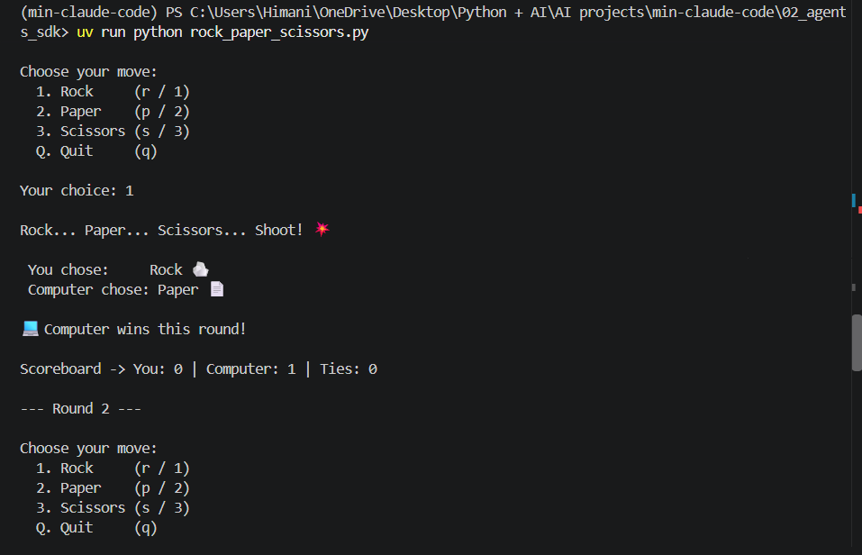
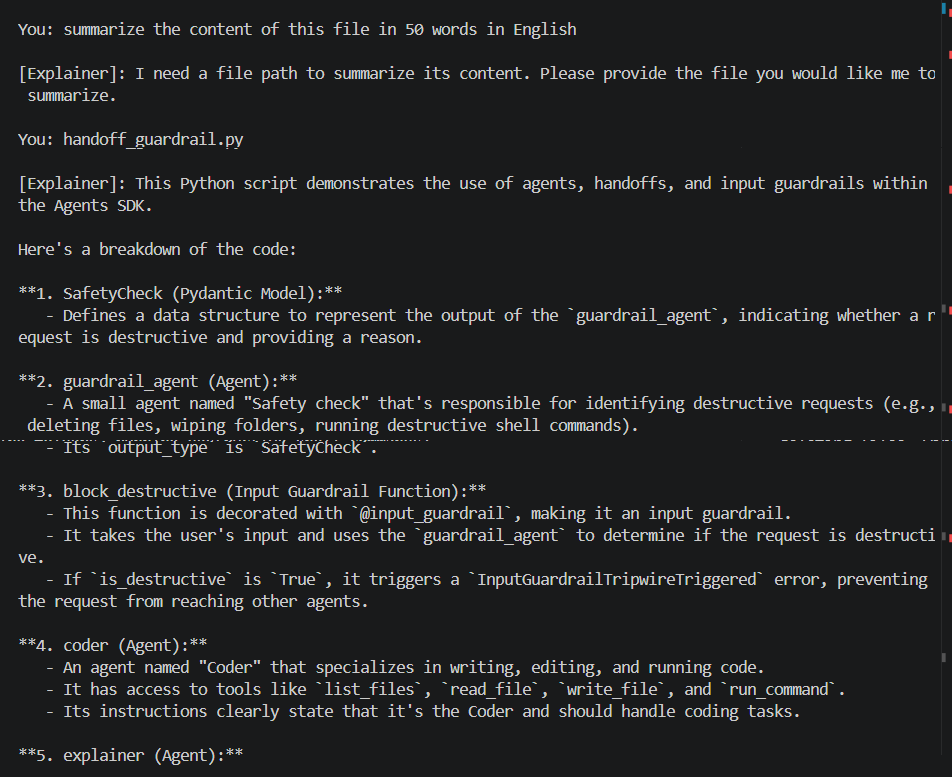
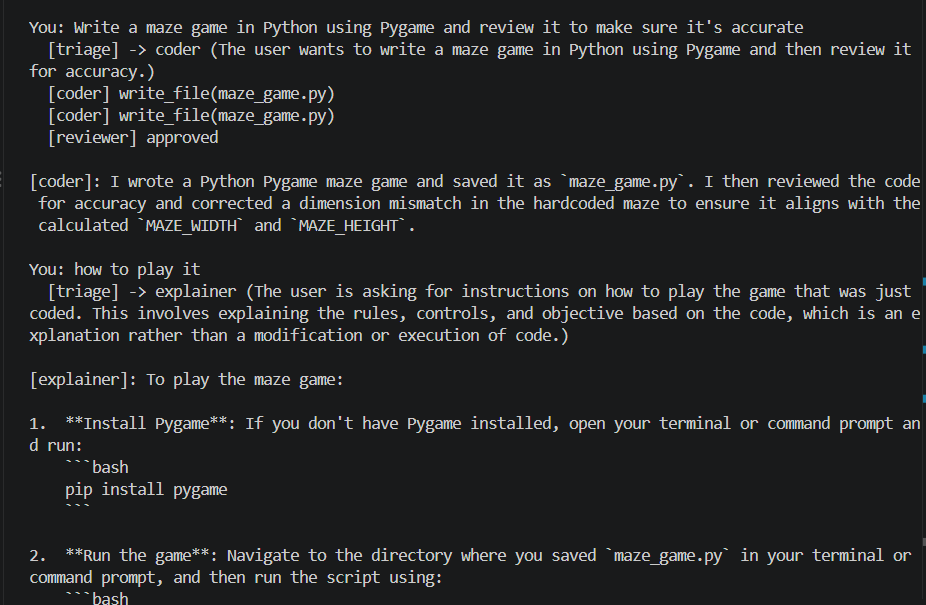

# AI Agent in Pure Python

A learning project where I build an AI agent step by step, using the free Gemini API and plain Python (no agent frameworks). Then I rebuild the same agent with agent frameworks to see what they do for me.

**Core idea:** an AI agent is just an LLM + tools + a loop.

---

## Step 1: A single API call (`step1.py`)

- Send one prompt to Gemini and print the response.
- The **system instruction** tells the model how to behave (e.g. "answer in short sentences").
- Messages have roles: `user` (me) and `model` (the AI).
- The last message must be from the `user`, otherwise the model has nothing to reply to.

**Learned:** how to talk to an LLM with code.

## Step 2: Chat with memory (`step2.py`)

- Added a `while` loop so I can keep chatting (type `exit` or `quit` to stop).
- Every message (mine and the model's) is saved in a `messages` list. This list is the **context window**.
- The whole list is sent to the model every time, so it remembers earlier messages.
- The LLM itself has no memory. The "memory" is just us resending the history.

**Learned:** how chat works, and why context matters.

## Step 3: Tool calling (`step3.py`)

- Gave the model a **tool**: a Python function `read_file(path)` that reads a file.
- We describe the tool to the model (name, what it does, what inputs it needs) in `TOOL_SCHEMAS`.
- The model can't run code itself. It only **asks** us to run the tool.

How the loop works:
1. Send the messages + tool description to the model.
2. If the model asks for a tool call → we run `read_file`, add the result to `messages`, and loop again.
3. If the model doesn't ask for a tool → it has the final answer, so print it and stop.

**Learned:** this loop (model → tool → result → model) is what makes it an **agent**.

## Step 4: Mini Claude Code (`agent.py`)

- Gave the agent 4 tools, the same basic kit a coding assistant like Claude Code uses:
  - `list_files` — see what's in a folder
  - `read_file` — read a file
  - `write_file` — create or overwrite a file
  - `run_command` — run a shell command (it asks me `y/N` first, so it can't run anything without my approval)
- Same loop as Step 3, but now the model can call several tools in a row until the task is done.

### Demo: a snake game from one sentence

I typed this in plain English:

```
You: in already existing snake_game directory make a simple snake game in Python using Pygame that I can play
```

The agent decided on its own what to do:
1. `list_files('snake_game')` → checked what was already in the folder.
2. `write_file('snake_game/main.py', ...)` → wrote the whole game.

I didn't write any game code. Running `snake_game/main.py` (needs `pygame` installed) opened a working game:


**Learned:** with just 4 tools and a loop, an LLM can turn a plain-English request into working code — a mini Claude Code in pure Python.

---

## How to run

1. Get a free API key from [Google AI Studio](https://aistudio.google.com/).
2. Create a `.env` file with: `GEMINI_API_KEY=your_key_here`
3. Install and run:
   ```
   uv sync
   uv run step1.py
   ```

---

# AI Agent using Frameworks

In the pure Python version I wrote everything myself: the loop, the `messages` memory, and the JSON schema for every tool. Agent frameworks do that work for me. Here I rebuild the same coding agent with frameworks and compare.

## 1. CrewAI (`01_crewai/`)

CrewAI is the simplest of them all. **No loop, no memory list, no tool schemas.** I just describe the agent like a job posting, and CrewAI runs the model → tool → result loop behind the scenes.

The code only needs 4 things:
- **Tools** — normal Python functions with a `@tool` decorator. CrewAI reads the docstring and type hints to describe the tool to the model, so no `TOOL_SCHEMAS`.
- **Agent** — a `role`, a `goal` and a `backstory` (who it is), plus its tools and model.
- **Task** — what to do (`description`) and what the answer should look like (`expected_output`).
- **Crew** — puts agents and tasks together. `crew.kickoff()` runs everything.

It also makes **multi-agent** easy: several agents, each with its own role, working on one job together.

### `agent.py` — one agent

- One agent, the **Coding Assistant**, with the same 4 tools as my pure Python agent: `list_files`, `read_file`, `write_file`, `run_command` (still asks me `y/N` first).
- I type a request, it becomes a `Task`, and a crew of one runs it.
- Compare: my pure Python `agent.py` is ~150 lines because it has the loop and schemas. This one is ~80 lines, and most of that is the tools.

### `crew.py` — multi-agent

Two agents working as a team, like a real dev team:

| Agent | Role | Tools | Job |
|---|---|---|---|
| `planner` | Tech Lead | `list_files`, `read_file` (read-only) | Looks at the folder and writes a build plan of 5 steps or fewer |
| `coder` | Coding Assistant (imported from `agent.py`) | all 4 tools | Follows the plan and builds it |

- The tasks run **in order**: first the plan, then the build.
- `context=[plan_task]` passes the planner's plan to the coder. That's how the two agents "talk".
- The planner can only read files, not write them or run commands. Giving each agent only the tools it needs keeps it safe.

### Demo: a Tetris game planned and built by the crew

I ran `uv run crew.py` and typed:

```
What should the crew build? build a simple Tetris game in Python using Pygame
```

1. **Tech Lead** called `list_files` to look at the folder, then wrote a step-by-step build plan (set up Pygame, a 10x20 grid with 30px blocks, a 300x600 play area, 60 FPS, …).
2. **Coder** got that plan through `context` and followed it to write the whole game in `01_crewai/main.py` (~400 lines): falling pieces, rotation, line clearing, score, a "next piece" preview and restart.

I didn't plan or write any of it. The crew's plan on the left, the working game on the right:


To play it: `cd 01_crewai` then `uv run main.py`.

### Setup notes (what broke for me)

- `01_crewai/` is its **own uv project** with its own `pyproject.toml` and `.venv`, so CrewAI's big list of packages stays out of the pure Python project.
- **CrewAI needs Python 3.11+.** One of its packages (`onnxruntime`) has no build for Python 3.10, so this folder is pinned to Python 3.12 (`.python-version`). uv downloads it automatically.
- **Gemini needs an extra:** install `crewai[google-genai]`, not just `crewai`, otherwise you get `Google Gen AI native provider not available`.
- The model is set as `MODEL = "gemini/gemini-3.6-flash"`. The `gemini/` prefix tells CrewAI to use Gemini, and it reads `GEMINI_API_KEY` from the `.env` in the project root by itself.

### How to run

```
cd 01_crewai
uv sync
uv run agent.py    # one agent
uv run crew.py     # Tech Lead + Coder team
```

### Pure Python vs CrewAI

| | Pure Python (`agent.py`) | CrewAI (`01_crewai/`) |
|---|---|---|
| Agent loop | I write it | Built in |
| Memory (`messages`) | I manage it | Built in |
| Tool description | JSON schema by hand | Docstring + `@tool` |
| Multi-agent | Hard, I'd build it all | A few lines (`crew.py`) |
| Setup | Light (28 packages installed, Python 3.10) | Heavy (144 packages installed, Python 3.11+) |
| Seeing what happens | Every step is my code | Hidden inside the framework (`verbose=True` helps) |

**Learned:** a framework saves a lot of code and makes multi-agent easy, but it hides the loop. Building it in pure Python first is what made CrewAI make sense to me.

## 2. OpenAI Agents SDK (`02_agents_sdk/`)

The Agents SDK is OpenAI's own agent framework. It sits between pure Python and CrewAI: **my functions, their loop.** There is no `role` / `goal` / `backstory`. An agent is just a system prompt (`instructions`), a model and a list of tools, and `Runner` runs the model → tool → result loop for me.

The code only needs a few things:
- **Tools** — normal Python functions with a `@function_tool` decorator. Like CrewAI, the SDK reads the docstring and type hints, so no `TOOL_SCHEMAS`.
- **Agent** — `name`, `instructions`, `model` and `tools`.
- **Runner** — `Runner.run_sync(agent, user_input)` runs the whole loop and gives back `result.final_output`.
- **Session** — `SQLiteSession` saves the chat history in a small database, so the agent remembers earlier messages. This replaces my `messages` list.

### Running it on Gemini instead of OpenAI

The SDK is made by OpenAI, but it is not locked to OpenAI models. Gemini has an **OpenAI-compatible endpoint**, so I point the OpenAI client at Google and use my free `GEMINI_API_KEY`:

```python
gemini_client = AsyncOpenAI(
    api_key=GEMINI_API_KEY,
    base_url="https://generativelanguage.googleapis.com/v1beta/openai/",
)
set_tracing_disabled(True)  # tracing uploads to OpenAI and would need an OpenAI key

MODEL = OpenAIChatCompletionsModel(model="gemini-2.5-flash", openai_client=gemini_client)
```

- `OpenAIChatCompletionsModel` is needed because the SDK uses OpenAI's newer Responses API by default, which Gemini does not support.
- `set_tracing_disabled(True)` turns off tracing. Tracing sends every run to OpenAI's dashboard, which needs an OpenAI key.
- Function tools, sessions, handoffs, guardrails and structured outputs all work on Gemini. Only OpenAI's hosted tools (`WebSearchTool`, `FileSearchTool`, `CodeInterpreterTool`) don't.

### `agent.py` — one agent

- The same coding agent again, with the same 4 tools: `list_files`, `read_file`, `write_file`, `run_command` (still asks me `y/N` first).
- `SQLiteSession("mini-agent")` gives it memory between messages, with no `messages` list to manage.
- ~95 lines, and most of that is the tools.

### Demo: a rock paper scissors game

I asked `agent.py` to build a rock paper scissors game, and it wrote `02_agents_sdk/rock_paper_scissors.py` with its `write_file` tool. The game has a menu (`1`/`r`, `2`/`p`, `3`/`s`, `q` to quit), a random computer move, a scoreboard after every round and a final score at the end:



To play it: `cd 02_agents_sdk` then `uv run python rock_paper_scissors.py`.

### `handoff_guardrail.py` — handoffs and guardrails

This is where the SDK shines. Two features that I'd have to build by hand in pure Python:

**Handoffs** — a **Triage** agent reads the request and passes it to the right specialist:

| Agent | Tools | Job |
|---|---|---|
| `triage` | none, only `handoffs=[coder, explainer]` | Decides who should handle the request |
| `coder` | all 4 tools | Writes, edits and runs code |
| `explainer` | `list_files`, `read_file` (read-only) | Explains the code, never changes anything |

**Guardrails** — the triage agent has an `@input_guardrail` that runs a tiny **Safety check** agent on every request. It returns a structured `SafetyCheck` (`is_destructive`, `reasoning`) using `output_type`. If the request looks destructive (deleting files, wiping folders, `rm -rf`), the tripwire fires, the run is stopped with `InputGuardrailTripwireTriggered`, and I print "Blocked".

By default the guardrail runs **at the same time** as the agent, to save time. To make it finish its check before the agent starts, use `@input_guardrail(run_in_parallel=False)`.

### Demo: the Explainer summarizing a file

I asked the triage agent to summarize a file. It handed the request to the **Explainer**, which used `read_file` and explained `handoff_guardrail.py` part by part: the `SafetyCheck` model, the guardrail agent, the `block_destructive` guardrail, the coder, and so on:



Something I noticed: my first message didn't name a file, so the Explainer asked which one. When I replied with just `handoff_guardrail.py`, it had already forgotten my "50 words in English" request and gave a long breakdown instead. That's because `handoff_guardrail.py` calls `Runner.run` **without a session**, so every message starts fresh. `agent.py` remembers because it passes `session=session`.

### Setup notes

- `02_agents_sdk/` is its **own uv project** (Python 3.12) like `01_crewai/`, with `openai-agents` and `python-dotenv`.
- The import is `from agents import ...`, but the package to install is `openai-agents`.
- **Free tier limits:** the free Gemini key allows only a small number of requests per day per model. One message to `handoff_guardrail.py` uses several requests (guardrail + triage + specialist + each tool call), so I hit `429 RESOURCE_EXHAUSTED` quickly. Switching to another Gemini model helps, because each model has its own quota.

### How to run

```
cd 02_agents_sdk
uv sync
uv run python agent.py               # one coding agent with memory
uv run python handoff_guardrail.py   # triage + coder + explainer, with a safety guardrail
```

### Pure Python vs CrewAI vs Agents SDK

| | Pure Python (`agent.py`) | CrewAI (`01_crewai/`) | Agents SDK (`02_agents_sdk/`) |
|---|---|---|---|
| Agent loop | I write it | Built in | Built in (`Runner`) |
| Memory | My `messages` list | Built in | `SQLiteSession` |
| Tool description | JSON schema by hand | Docstring + `@tool` | Docstring + `@function_tool` |
| How you describe an agent | System prompt | `role`, `goal`, `backstory` + `Task` | `instructions` (a system prompt) |
| Multi-agent | Hard, I'd build it all | Crew of agents + tasks | Handoffs |
| Safety checks | I'd build it all | Checks a task's output (`guardrail` on `Task`) | Checks input and output (input/output guardrails) |
| Setup | Light (28 packages, Python 3.10) | Heavy (144 packages, Python 3.11+) | Light (40 packages, Python 3.12) |
| Gemini support | Native (`google-genai`) | Native (`crewai[google-genai]`) | Through the OpenAI-compatible endpoint |

**Learned:** the Agents SDK feels closest to my pure Python agent: an agent is still just a system prompt + tools, and the SDK only takes over the loop and memory. Handoffs and guardrails are the big wins, and they work on Gemini too.

## 3. LangGraph (`03_langgraph/`)

LangGraph is the opposite of CrewAI: **nothing is hidden, I draw the agent myself.** The agent is a **graph**: boxes (nodes) connected by arrows (edges), with a shared state passed along. It's the same model → tool → result loop from my pure Python agent, just drawn out step by step.

The code only needs a few things:
- **State** — the data passed between steps. `MessagesState` is just the conversation (a list of messages). Every node reads it and adds new messages.
- **Nodes** — the steps. Each one is a normal Python function that takes the state and returns what to add.
- **Edges** — the arrows that say which node runs next. A **conditional edge** is a fork: a function looks at the state and picks the next node.
- **Checkpointer** — `InMemorySaver` saves the state after every node, so the agent remembers earlier messages. A `thread_id` picks which conversation to continue.
- **Tools** — normal Python functions with a `@tool` decorator. Like the other frameworks, it reads the docstring and type hints, so no `TOOL_SCHEMAS`.

### Running it on Gemini

LangGraph uses LangChain models, and `init_chat_model` can load any provider by its prefix:

```python
MODEL = "google_genai:gemini-2.5-flash"
model = init_chat_model(MODEL, api_key=GEMINI_API_KEY).bind_tools(list(TOOLS.values()))
```

- The `google_genai:` prefix tells LangChain to use Gemini. It needs the `langchain-google-genai` package.
- I pass `api_key=GEMINI_API_KEY` myself, so the same key from the `.env` works for every folder.

### `agent.py` — one agent, drawn as a graph

- The same 4 tools again: `list_files`, `read_file`, `write_file`, `run_command` (still asks me `y/N` first).
- 2 nodes: `agent` (calls Gemini) and `tools` (runs the tools Gemini asked for).
- 3 edges:

```
START ──► agent ──(asked for a tool?)── yes ──► tools
            ▲                                     │
            └─────────────────────────────────────┘
                        │
                        no
                        ▼
                       END
```

1. `START → agent` — every message goes to Gemini first.
2. `agent → tools` or `END` — a conditional edge. `should_continue` checks Gemini's reply: tool asked for → `tools`, otherwise → `END`.
3. `tools → agent` — after running a tool, always go back to Gemini with the result.

In pure Python this loop was a `while` loop I wrote. Here it's the `tools → agent` edge.

### `multi_agent.py` — multi-agent with a review loop

This is where LangGraph shines. Each specialist is the graph from `agent.py`, compiled and dropped into a bigger graph as **one node**:

```
START -> triage -> explainer -> END
                -> coder -> reviewer -> END
                      ^          |
                      +----------+   (changes requested)
```

| Node | Tools | Job |
|---|---|---|
| `triage` | none | Reads the request and picks `coder` or `explainer` (structured output: `Route`) |
| `coder` | all 4 tools | Writes, edits and runs code |
| `explainer` | `list_files`, `read_file` (read-only) | Explains the code, never changes anything |
| `reviewer` | none | Checks the coder's work (structured output: `Review`). Approves, or sends feedback back to the coder |

- The `reviewer → coder` edge makes a real **cycle**: the coder fixes what the reviewer asked for, then the reviewer checks again.
- `MAX_REVISIONS = 2` stops it from looping forever. After 2 rounds it ships as is.
- The state has extra fields on top of the messages: `route`, `approved` and `revisions`.

### Demo: a maze game, coded, reviewed and explained

I ran `multi_agent.py` and typed:

```
You: Write a maze game in Python using Pygame and review it to make sure it's accurate
```

1. **Triage** sent it to the **coder**.
2. The **coder** wrote `maze_game.py`, then checked its own work and wrote it again to fix a size mismatch (the hardcoded maze didn't match `MAZE_WIDTH` and `MAZE_HEIGHT`).
3. The **reviewer** approved it on the first try.

Then I asked `how to play it`. Triage sent that to the **explainer**, which explained how to install Pygame and run the game. It knew which game I meant because the checkpointer kept the earlier messages:



To play it: `cd 03_langgraph` then `uv run python maze_game.py` (needs `pygame` installed). Move the red square with the arrow keys and reach the green square to win.

### Setup notes (what broke for me)

- `03_langgraph/` is **not** its own uv project. LangGraph is light enough, so I added it to the root project with `uv add langchain langchain-google-genai langgraph` (Python 3.10). The root project went from 28 to 52 packages.
- **Wrong environment:** at first I installed LangGraph into my system Python, not the project's `.venv`, so `uv run` failed with `No module named 'langgraph'`. Fix: `uv add`, which installs into the project and saves it in `pyproject.toml`.
- **Gemini replies as content blocks:** Gemini sometimes returns the reply as a list of blocks (text + a `signature`), not a plain string, so `message.content` printed a raw list. Fix: print `message.text`, which gives just the text either way (done in `multi_agent.py`).

### How to run

```
uv sync
cd 03_langgraph
uv run python agent.py         # one agent, drawn as a graph
uv run python multi_agent.py   # triage + coder + explainer + reviewer
```

### Pure Python vs CrewAI vs Agents SDK vs LangGraph

| | Pure Python (`agent.py`) | CrewAI (`01_crewai/`) | Agents SDK (`02_agents_sdk/`) | LangGraph (`03_langgraph/`) |
|---|---|---|---|---|
| Agent loop | I write it | Built in | Built in (`Runner`) | I draw it as nodes + edges |
| Memory | My `messages` list | Built in | `SQLiteSession` | Checkpointer (`InMemorySaver`) |
| Tool description | JSON schema by hand | Docstring + `@tool` | Docstring + `@function_tool` | Docstring + `@tool` |
| How you describe an agent | System prompt | `role`, `goal`, `backstory` + `Task` | `instructions` (a system prompt) | System prompt inside a node |
| Multi-agent | Hard, I'd build it all | Crew of agents + tasks | Handoffs | Graphs inside a graph, with cycles |
| Safety checks | I'd build it all | Checks a task's output (`guardrail` on `Task`) | Checks input and output (input/output guardrails) | I'd add a node for it (like the reviewer) |
| Setup | Light (28 packages, Python 3.10) | Heavy (144 packages, Python 3.11+) | Light (40 packages, Python 3.12) | Medium (52 packages with the root project, Python 3.10) |
| Gemini support | Native (`google-genai`) | Native (`crewai[google-genai]`) | Through the OpenAI-compatible endpoint | Native (`langchain-google-genai`) |

**Tradeoff:** LangGraph gives me the most control and the clearest picture of what runs when. The review loop was easy because a cycle is just one more edge. But I design every step myself, so it takes more code than CrewAI or the Agents SDK. Also, `InMemorySaver` forgets everything when the program exits, unlike the Agents SDK's `SQLiteSession`.
