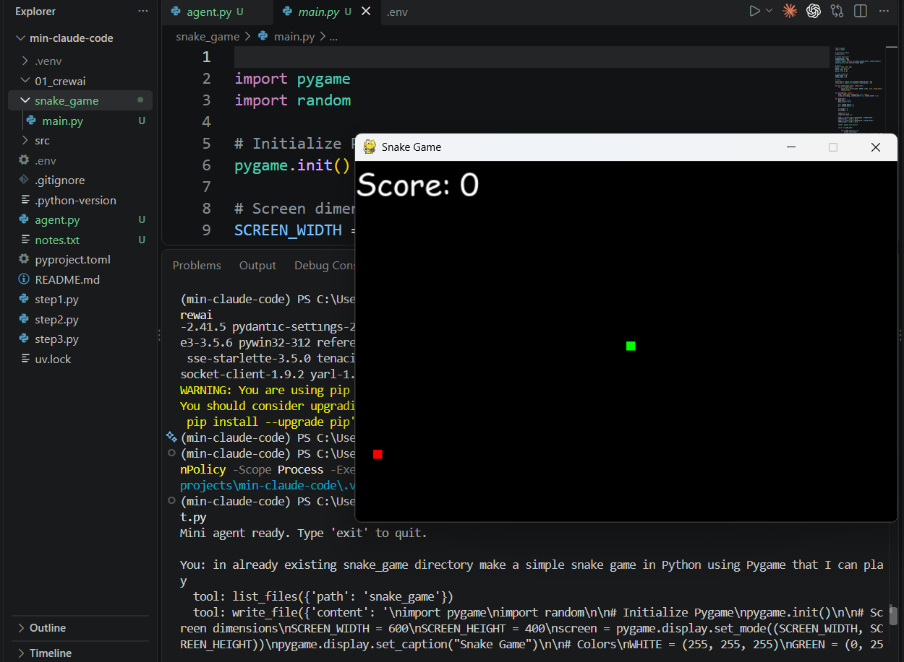
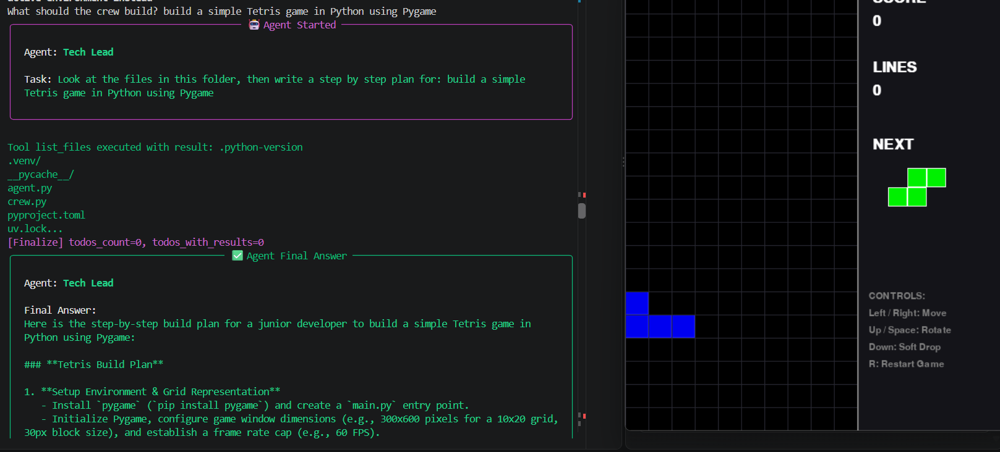

# AI Agent in Pure Python

A learning project where I build an AI agent step by step, using the free Gemini API and plain Python (no agent frameworks). Then I rebuild the same agent with agent frameworks to see what they do for me.

**Core idea:** an AI agent is just an LLM + tools + a loop.

---

## Step 1: A single API call (`step1.py`)

- Send one prompt to Gemini and print the response.
- The **system instruction** tells the model how to behave (e.g. "answer in short sentences").
- Messages have roles: `user` (me) and `model` (the AI).
- The last message must be from the `user`, otherwise the model has nothing to reply to.

**Learned:** how to talk to an LLM with code.

## Step 2: Chat with memory (`step2.py`)

- Added a `while` loop so I can keep chatting (type `exit` or `quit` to stop).
- Every message (mine and the model's) is saved in a `messages` list. This list is the **context window**.
- The whole list is sent to the model every time, so it remembers earlier messages.
- The LLM itself has no memory. The "memory" is just us resending the history.

**Learned:** how chat works, and why context matters.

## Step 3: Tool calling (`step3.py`)

- Gave the model a **tool**: a Python function `read_file(path)` that reads a file.
- We describe the tool to the model (name, what it does, what inputs it needs) in `TOOL_SCHEMAS`.
- The model can't run code itself. It only **asks** us to run the tool.

How the loop works:
1. Send the messages + tool description to the model.
2. If the model asks for a tool call → we run `read_file`, add the result to `messages`, and loop again.
3. If the model doesn't ask for a tool → it has the final answer, so print it and stop.

**Learned:** this loop (model → tool → result → model) is what makes it an **agent**.

## Step 4: Mini Claude Code (`agent.py`)

- Gave the agent 4 tools, the same basic kit a coding assistant like Claude Code uses:
  - `list_files` — see what's in a folder
  - `read_file` — read a file
  - `write_file` — create or overwrite a file
  - `run_command` — run a shell command (it asks me `y/N` first, so it can't run anything without my approval)
- Same loop as Step 3, but now the model can call several tools in a row until the task is done.

### Demo: a snake game from one sentence

I typed this in plain English:

```
You: in already existing snake_game directory make a simple snake game in Python using Pygame that I can play
```

The agent decided on its own what to do:
1. `list_files('snake_game')` → checked what was already in the folder.
2. `write_file('snake_game/main.py', ...)` → wrote the whole game.

I didn't write any game code. Running `snake_game/main.py` (needs `pygame` installed) opened a working game:



**Learned:** with just 4 tools and a loop, an LLM can turn a plain-English request into working code — a mini Claude Code in pure Python.

---

## How to run

1. Get a free API key from [Google AI Studio](https://aistudio.google.com/).
2. Create a `.env` file with: `GEMINI_API_KEY=your_key_here`
3. Install and run:
   ```
   uv sync
   uv run step1.py
   ```

---

# AI Agent using Frameworks

In the pure Python version I wrote everything myself: the loop, the `messages` memory, and the JSON schema for every tool. Agent frameworks do that work for me. Here I rebuild the same coding agent with frameworks and compare.

## 1. CrewAI (`01_crewai/`)

CrewAI is the simplest of them all. **No loop, no memory list, no tool schemas.** I just describe the agent like a job posting, and CrewAI runs the model → tool → result loop behind the scenes.

The code only needs 4 things:
- **Tools** — normal Python functions with a `@tool` decorator. CrewAI reads the docstring and type hints to describe the tool to the model, so no `TOOL_SCHEMAS`.
- **Agent** — a `role`, a `goal` and a `backstory` (who it is), plus its tools and model.
- **Task** — what to do (`description`) and what the answer should look like (`expected_output`).
- **Crew** — puts agents and tasks together. `crew.kickoff()` runs everything.

It also makes **multi-agent** easy: several agents, each with its own role, working on one job together.

### `agent.py` — one agent

- One agent, the **Coding Assistant**, with the same 4 tools as my pure Python agent: `list_files`, `read_file`, `write_file`, `run_command` (still asks me `y/N` first).
- I type a request, it becomes a `Task`, and a crew of one runs it.
- Compare: my pure Python `agent.py` is ~150 lines because it has the loop and schemas. This one is ~80 lines, and most of that is the tools.

### `crew.py` — multi-agent

Two agents working as a team, like a real dev team:

| Agent | Role | Tools | Job |
|---|---|---|---|
| `planner` | Tech Lead | `list_files`, `read_file` (read-only) | Looks at the folder and writes a build plan of 5 steps or fewer |
| `coder` | Coding Assistant (imported from `agent.py`) | all 4 tools | Follows the plan and builds it |

- The tasks run **in order**: first the plan, then the build.
- `context=[plan_task]` passes the planner's plan to the coder. That's how the two agents "talk".
- The planner can only read files, not write them or run commands. Giving each agent only the tools it needs keeps it safe.

### Demo: a Tetris game planned and built by the crew

I ran `uv run crew.py` and typed:

```
What should the crew build? build a simple Tetris game in Python using Pygame
```

1. **Tech Lead** called `list_files` to look at the folder, then wrote a step-by-step build plan (set up Pygame, a 10x20 grid with 30px blocks, a 300x600 play area, 60 FPS, …).
2. **Coder** got that plan through `context` and followed it to write the whole game in `01_crewai/main.py` (~400 lines): falling pieces, rotation, line clearing, score, a "next piece" preview and restart.

I didn't plan or write any of it. The crew's plan on the left, the working game on the right:



To play it: `cd 01_crewai` then `uv run main.py`.

### Setup notes (what broke for me)

- `01_crewai/` is its **own uv project** with its own `pyproject.toml` and `.venv`, so CrewAI's big list of packages stays out of the pure Python project.
- **CrewAI needs Python 3.11+.** One of its packages (`onnxruntime`) has no build for Python 3.10, so this folder is pinned to Python 3.12 (`.python-version`). uv downloads it automatically.
- **Gemini needs an extra:** install `crewai[google-genai]`, not just `crewai`, otherwise you get `Google Gen AI native provider not available`.
- The model is set as `MODEL = "gemini/gemini-3.6-flash"`. The `gemini/` prefix tells CrewAI to use Gemini, and it reads `GEMINI_API_KEY` from the `.env` in the project root by itself.

### How to run

```
cd 01_crewai
uv sync
uv run agent.py    # one agent
uv run crew.py     # Tech Lead + Coder team
```

### Pure Python vs CrewAI

| | Pure Python (`agent.py`) | CrewAI (`01_crewai/`) |
|---|---|---|
| Agent loop | I write it | Built in |
| Memory (`messages`) | I manage it | Built in |
| Tool description | JSON schema by hand | Docstring + `@tool` |
| Multi-agent | Hard, I'd build it all | A few lines (`crew.py`) |
| Setup | Light (28 packages installed, Python 3.10) | Heavy (144 packages installed, Python 3.11+) |
| Seeing what happens | Every step is my code | Hidden inside the framework (`verbose=True` helps) |

**Learned:** a framework saves a lot of code and makes multi-agent easy, but it hides the loop. Building it in pure Python first is what made CrewAI make sense to me.
